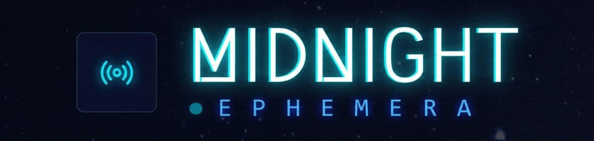

<br/>
<p align="center">
  
</p>

<p align="center">
  <em>"Scream into the void, and let the blockchain echo back."</em>
</p>

<p align="center">
  <a href="https://midnight-radio.vercel.app"><strong>Live Demo</strong></a>
  ·
  <a href="https://sepolia.mantlescan.xyz/address/0x0b118a0F67D6F2329ad993A844549aED4cEa0E15">Mantle Contract</a>
  ·
  <a href="https://sepolia.arbiscan.io/address/0xA3505e375C6d8CB1f0b3C934b30b93EF8f3211c5">Arbitrum Contract</a>
</p>

<br/>

---

## 🌌 Project Description

**Midnight Radio** is a decentralized, ephemeral voice streaming protocol built for the **Mantle** and **Arbitrum** ecosystems. It creates a digital "Void"—a space where voice notes exist as live broadcasts for 24 hours before fading into silence, leaving behind only an immutable on-chain footprint.

Unlike traditional social audio (Clubhouse, Twitter Spaces) which is ephemeral-by-default but centralized, or podcasting which is permanent but heavy, Midnight Radio sits in the **uncanny valley of digital permanence**: the *experience* is fleeting, but the *proof* is eternal.

Every broadcast is an **ERC-721 NFT**. The audio is pinned to **IPFS** for exactly 24 hours via a scheduled unpinning service, creating a "Time-to-Live" (TTL) mechanic enforced by the protocol. However, the NFT itself remains in the broadcaster's wallet forever—a ghost of the transmission, a "Proof of Voice."

Midnight Radio answers a specific question about Web3 social:
*Can we build a social graph based on fleeting moments rather than permanent feeds?*

---

## 💾 CORE FEATURES

### 📡 [BROADCAST] The Void Protocol
Users record 30-to-90 second voice notes directly in the browser. These are compressed (Opus/MP3), analyzed for sentiment (Mood detection), and uploaded to IPFS. The protocol then mints a **VoiceNote NFT** on-chain containing the metadata and IPFS hash.
*   **Mechanism**: Record → Upload → Mint → Stream.
*   **Result**: Instant presence in the global stream.

### 🗣️ [ECHO] On-Chain Reaction Threads
Listeners don't just "comment"—they **Echo**. An Echo is a secondary voice note linked inextricably to the parent broadcast via the `EchoRegistry` smart contract. Echoes are shorter (30s max) and create a directed acyclic graph (DAG) of audio conversations.
*   **Mechanism**: Listen → Record Echo → Link on Chain.

### 💸 [VALUE] Direct Audio Tipping
Value flows directly from listener to broadcaster. The `TippingPool` contract allows instant, gas-efficient micro-tipping in **$MNT** or **$ETH**. No platform rake, no middleman delays.
*   **Mechanism**: One-click tip → Instant transfer.

### ⏳ [EPHEMERALITY] The 24-Hour Decay
The "Midnight" engine runs a specialized scheduler. Exactly 24 hours after a note's timestamp, the active stream drops it. The IPFS pin is released. The audio fades. The interface shows only a "Ghost Trace" where the audio used to be.
*   **Philosophy**: Urgency creates value. If it lasts forever, no one listens *now*.

---

## 🧑‍💻 User Flow

### 🟣 BROADCAST MODE
1.  **Enter the Booth**: User opens the frequency tuner (frontend).
2.  **Record**: Captures raw audio via Web Audio API.
3.  **Transmit**:
    *   Audio → Backend Processor (Normalization + Waveform Gen).
    *   File → IPFS (Pinata).
    *   Transaction → Wallet signature (Mint NFT).
4.  **Live**: The note appears instantly on the global waveform for all connected listeners.

### 🟢 LISTENER MDOE
1.  **Tune In**: Users see a real-time visualization of active signals.
2.  **Playback**: Stream audio directly from IPFS gateways.
3.  **React**:
    *   **Tip**: Send value to the creator.
    *   **Echo**: Broadcast a reply into the thread.

---

## 🛠️ Tech Stack

### ⛓️ Blockchain Layer
*   **Networks**: Mantle Sepolia, Arbitrum Sepolia
*   **Contracts**: Solidity (Hardhat)
    *   `VoiceNoteNFT.sol`: ERC-721 Core
    *   `EchoRegistry.sol`: On-chain graph linkage
    *   `TippingPool.sol`: Payment routing

### 🖥️ Application Layer
*   **Frontend**: React, Vite, TailwindCSS
    *   **Web3**: Wagmi, Viem, RainbowKit
    *   **Audio**: Web Audio API, Wavesurfer.js
*   **Backend**: Bun, Hono
    *   **Real-time**: WebSockets (ws)
    *   **Processing**: FFmpeg (Audio normalization)

### 📦 Storage & Data
*   **Hot Storage**: IPFS (Pinata)
*   **Metadata**: OpenSea Standard JSON

---

## 🧠 Why Midnight Matters

**Midnight Radio** is an experiment in **Digital scarcity applied to time**.

In a world where everything is recorded, archived, and searchable forever, the freedom to speak *temporarily* is lost. Midnight Radio uses the blockchain not to archive the *content* forever, but to archive the *fact that it happened*.

*   **Censorship Resistant**: The record of the broadcast is on-chain.
*   **Emotionally Resonant**: You have to be there.
*   **Economically Direct**: Creator and audience are connected by a shared ledger.

> *"We transmit into the dark, hoping something echoes back."*

---

## 🚀 Getting Started

### Prerequisites
*   Bun (Required for Backend)
*   Node.js 18+ (Frontend)
*   MetaMask / Rainbow Wallet
*   Testnet $MNT or $ETH

### Installation

```bash
# Clone the frequency
git clone https://github.com/SATISH-JALAN/Midnight.git

# Install dependencies (Frontend)
cd frontend
pnpm install
cp .env.example .env

# Install dependencies (Backend)
cd backend
bun install
cp .env.example .env
```

### Run the Signal

```bash
# Terminal 1: Backend
cd backend
bun run dev

# Terminal 2: Frontend
cd frontend
pnpm run dev
```

Open [http://localhost:5173](http://localhost:5173) to start broadcasting.
